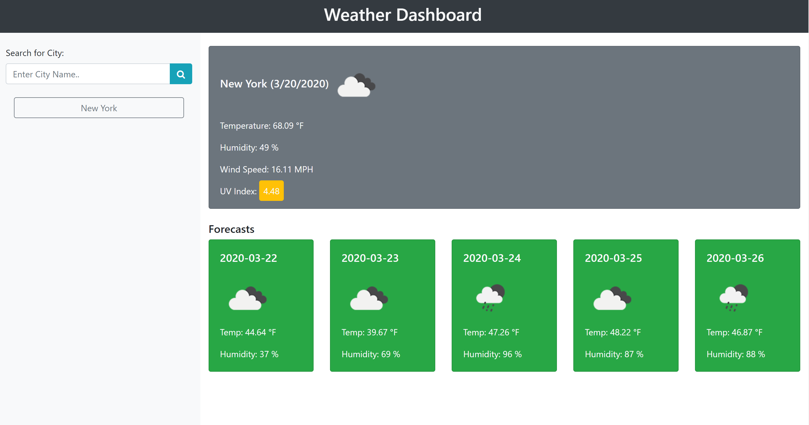

# Weather Dashboard

Dashboard to display weather. The dashboard displays current weather and the next 5 day forecast for the searched city. 

[Sample](https://virus43.github.io/06-weather-dashboard/)

## Built With

* HTML
* [Bootstrap](https://getbootstrap.com/)
* JQuery, Javascript, AJAX
* [OpenWeather API](https://openweathermap.org/)

## Website Features

* Ability to search current weather and forecasts for over 200,000 cities using the openweathermap API 
* Displays current weather which includes temperature, humidity, wind speed and UV index of the searched city
* UV index is color coded to display green if UV index <= 2, yellow if 2 < UV index <= 5 and red if UV index > 5
* Displays next 5 days forecast (temperature and humidity) of the searched city
* Displays weather condition image for both current weather and 5 day forecasts
* Stores historical searched cities on buttons and displays the weather on click
* On page refresh, weather for last searched city is displayed
